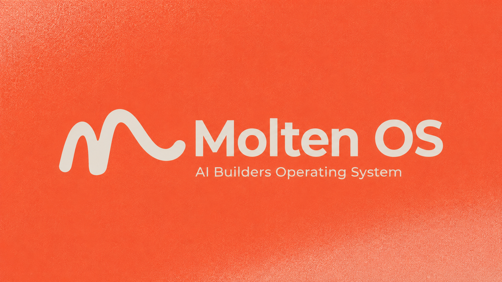

# Molten OS Core



Molten OS Core is a simple but powerful product development operating system from [switch dimension](https://switchdimension.com). It gives AI coding agents reusable skills for turning an early product idea into clear brand direction, a usable visual system, and a landing page you can test with a real audience.

All skills use the **`molten-<name>`** convention so they are easy to distinguish from third-party skills in `npx skills ls`.

## Installation

```bash
npx skills add switch-dimension/molten-os-core
```

Install a single skill:

```bash
npx skills add switch-dimension/molten-os-core --skill molten-landing
npx skills add switch-dimension/molten-os-core --skill molten-brand
npx skills add switch-dimension/molten-os-core --skill molten-design
npx skills add switch-dimension/molten-os-core --skill molten-skill-manage
```

## Available Skills


| Skill              | Description                                                                                                                                       |
| ------------------ | ------------------------------------------------------------------------------------------------------------------------------------------------- |
| **molten-brand**   | Helps define the brand, positioning, audience, messaging, and voice, then writes `molten-docs/brand/brand.md`.                                    |
| **molten-design**  | Turns the brand document into a practical design system in `molten-docs/design/design.md`, plus a visual preview in `molten-docs/design/example.html`. |
| **molten-landing** | Creates or audits high-converting landing pages, using the brand and design system to help you test your product idea quickly with an audience.   |
| **molten-skill-manage** | Manages agent skills with the skills.sh CLI (`npx skills`) — install, update, remove, list, and find skills.                                       |


## How To Use The Full Workflow

Molten works best as a simple sequence:

1. Start with **molten-brand** to create a brand document. This gives your product idea a clear audience, position, message, and voice.
2. Then use **molten-design** to create a design system. This turns the brand into the look and feel of the thing you want to build.
3. Finally, use **molten-landing** to create a landing page informed by both the brand and the design system.

Together, these core skills help you bring a product idea to market quickly, with enough clarity and polish to test it with real people.


## License

Released under the [Unlicense](LICENSE), so anyone can use, copy, modify, publish, distribute, or sell it for any purpose.