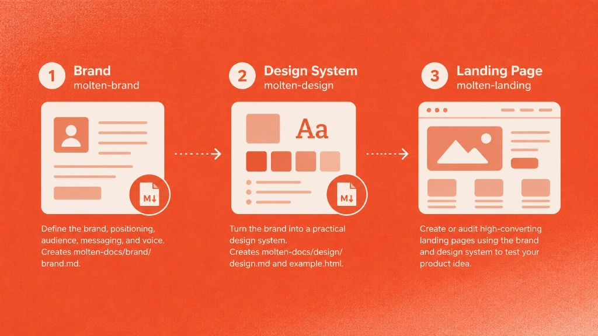

# Molten OS Core


### Turn a raw product idea into a landing page you can test with real people — brand, design system, and page — in an afternoon, not a quarter.

Molten OS Core is a set of AI agent skills from [Switch Dimension](https://switchdimension.com) and AI builder YouTuber [Rob Shocks](https://youtube.com/robshocks). It hands your coding agent the combined playbooks of branding and design thought leaders, codified into skills, so your idea gets its best possible first shot in front of a real audience.

Drop this prompt into your AI agent to get started:

```
install all the skills in this repo to my project - https://github.com/switch-dimension/molten-os-core
```

> Released under the MIT license — copy it, fork it, and use it as inspiration for your own evolving system. [Full install options below.](#installation)

## Why start with a landing page?

One of the fastest, cheapest ways to de-risk an idea is to put a landing page in front of real people. A good landing page is a sharper test than a pitch deck or a business plan, because it forces you to answer the questions that actually decide whether a product works:

- **Who** is this for?
- **What** pain are they feeling?
- **Why** does that pain matter to them right now?
- **How** do the benefits of your product remove it?

Add a waitlist or a paid pre-order and you get the only feedback that counts: will people act? You learn that **before** you commit months to building the wrong thing.

Even in the age of AI, doing this well is slow and easy to get wrong. Molten OS Core compresses brand, design, and landing-page craft into reusable skills so your agent does it with you — quickly, and with enough polish to take seriously.

## What you get

Three core skills that build on each other, plus a helper for managing them:

| Skill              | What it does for you                                                                                                                              |
| ------------------ | ------------------------------------------------------------------------------------------------------------------------------------------------- |
| **molten-brand**   | Pins down who you're for, the pain you solve, your positioning, message, and voice — written to `molten-docs/brand/brand.md`.                      |
| **molten-design**  | Turns that brand into a practical design system in `molten-docs/design/design.md`, plus a live visual preview in `molten-docs/design/example.html`. |
| **molten-landing** | Creates (or audits) a high-converting landing page from your brand and design system, so you can test the idea with an audience fast.              |
| **molten-skill-manage** | Manages the skills themselves via the skills.sh CLI (`npx skills`) — install, update, remove, list, and find skills.                          |

## How it works



Molten works best as a simple sequence:

1. **molten-brand** — give your idea a clear audience, position, message, and voice.
2. **molten-design** — turn that brand into a look and feel you can build with.
3. **molten-landing** — ship a landing page informed by both, ready for real visitors.

Together these take a product idea to market quickly, with enough clarity and polish to test it with real people.

## Installation

Paste this repo into your agent and drop in the prompt above, or install manually with the [skills.sh](https://github.com/vercel-labs/skills) CLI:

```
https://github.com/switch-dimension/molten-os-core
```

Install all skills:

```bash
npx skills add switch-dimension/molten-os-core
```

Install a single skill:

```bash
npx skills add switch-dimension/molten-os-core --skill molten-landing
```

All skills use the **`molten-<name>`** convention so they are easy to distinguish from third-party skills in `npx skills ls`.

## License

Released under the [MIT License](LICENSE). You may use, copy, modify, merge, publish, distribute, sublicense, and sell copies, provided the license and copyright notice are included in redistributions.
