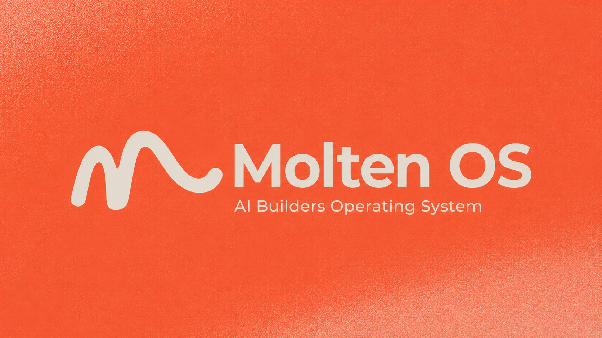
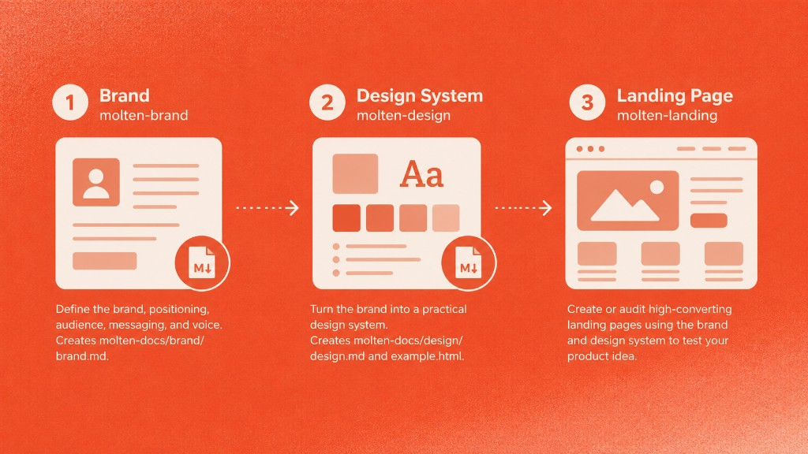

# Molten OS Core - Idea in, testable product out



### Turn a raw product idea into a validated landing page you can test with real people — score, brand, design system, and page — in an afternoon, not a quarter.

Molten OS Core is a set of AI agent skills from [Switch Dimension](https://switchdimension.com) and AI builder YouTuber [Rob Shocks](https://youtube.com/robshocks). It helps your coding agent challenge the idea first, then turn the strongest version into brand, design, and a landing page, so your product gets its best possible first shot in front of a real audience.

Drop this prompt into your AI agent to get started:

```
install all the skills in this repo to my project - https://github.com/switch-dimension/molten-os-core
```

> Released under the MIT license — copy it, fork it, and use it as inspiration for your own evolving system. [Full install options below.](#installation)

## Why validate before building?

One of the fastest, cheapest ways to de-risk an idea is to pressure-test the assumptions, then put the strongest version in front of real people. A good validation pass and landing page are sharper tests than a pitch deck or a business plan, because they force you to answer the questions that actually decide whether a product works:

- **Who** is this for?
- **What** pain are they feeling?
- **Why** does that pain matter to them right now?
- **How** do the benefits of your product remove it?

Add a waitlist or a paid pre-order and you get the only feedback that counts: will people act? You learn that **before** you commit months to building the wrong thing.

Even in the age of AI, doing this well is slow and easy to get wrong. Molten OS Core compresses brand, design, and landing-page craft into reusable skills so your agent does it with you — quickly, and with enough polish to take seriously.

## What you get

Molten OS Core has two kinds of skills: a **product pipeline** that takes an idea to a testable landing page, and **utility skills** you can use anytime.

### Product skills

Run these in order. Each step writes artifacts under `molten-docs/`.

| Skill | What it does for you |
| --- | --- |
| **molten-validate** | Adversarially scores a product idea with quick, full-interview, or re-validation modes; writes `molten-docs/validate/product-score-N.md`. |
| **molten-brand** | Pins down who you're for, the pain you solve, your positioning, message, and voice — written to `molten-docs/brand/brand.md`. |
| **molten-design** | Turns that brand into a practical design system for one surface at a time — landing, web, mobile, or desktop — plus a live visual preview. |
| **molten-landing** | Creates (or audits) a high-converting landing page from your brand and design system, so you can test the idea with an audience fast. |

### Utility skills

Cross-cutting helpers. Not part of the product workflow — install and use as needed.

| Skill | What it does for you |
| --- | --- |
| **molten-search** | Routes search and research queries to the right backend — quick web lookup, recent social pulse, platform-specific fetch, or cited web research. |
| **molten-skill-manage** | Manages skills via the skills.sh CLI (`npx skills`) — install, update, remove, list, and find skills. |

Use **molten-search** during validation for competitor or market research. Use **molten-skill-manage** to install or update skills in a project.

## How it works



Molten works best as a simple sequence:

1. **molten-validate** — pressure-test the idea, score the evidence, and define the riskiest assumption to test.
2. **molten-brand** — give a promising idea a clear audience, position, message, and voice.
3. **molten-design** — turn that brand into a focused visual system for one surface: landing page, web product, mobile product, or desktop product.
4. **molten-landing** — ship a landing page informed by both, ready for real visitors.

Together these take a product idea to market quickly, with enough clarity and polish to test it with real people.

## Installation

Paste this repo into your agent and drop in the prompt above, or install manually with the [skills.sh](https://github.com/vercel-labs/skills) CLI:

```
https://github.com/switch-dimension/molten-os-core
```

Install all skills:

```bash
npx skills add switch-dimension/molten-os-core
```

Install a single skill:

```bash
npx skills add switch-dimension/molten-os-core --skill molten-landing
```

Install product skills only:

```bash
npx skills add switch-dimension/molten-os-core --skill molten-validate molten-brand molten-design molten-landing
```

Install utility skills only:

```bash
npx skills add switch-dimension/molten-os-core --skill molten-search molten-skill-manage
```

All skills use the **`molten-<name>`** convention so they are easy to distinguish from third-party skills in `npx skills ls`.

## Changelog

Release history and version notes: [CHANGELOG.md](CHANGELOG.md). Current release: **v1.3.1**.

## License

Released under the [MIT License](LICENSE). You may use, copy, modify, merge, publish, distribute, sublicense, and sell copies, provided the license and copyright notice are included in redistributions.
